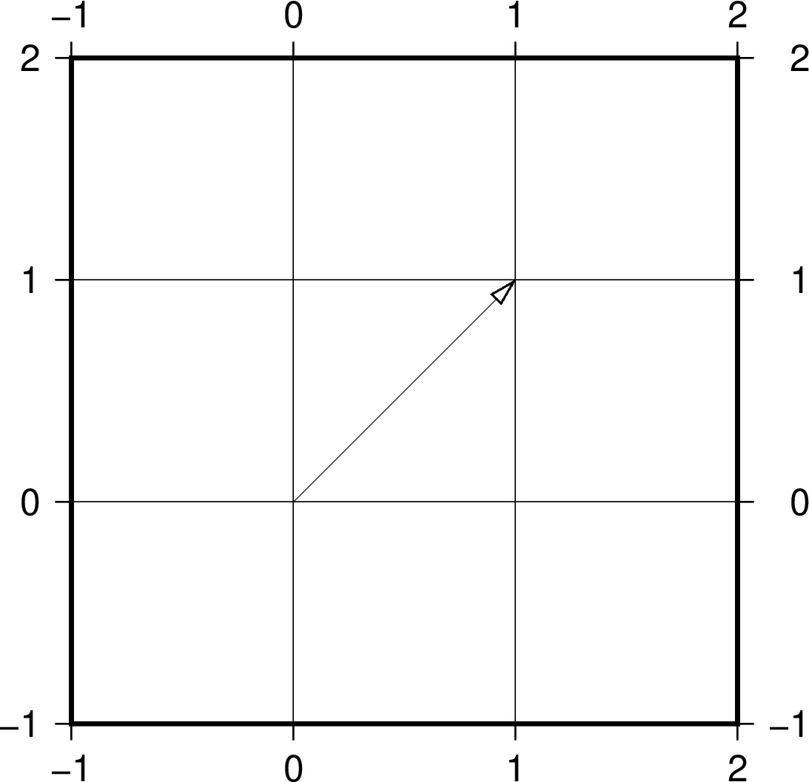
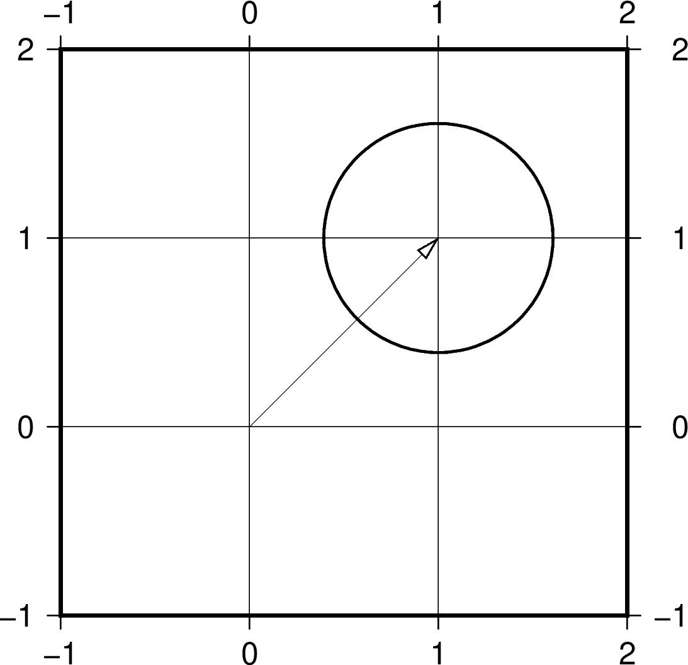
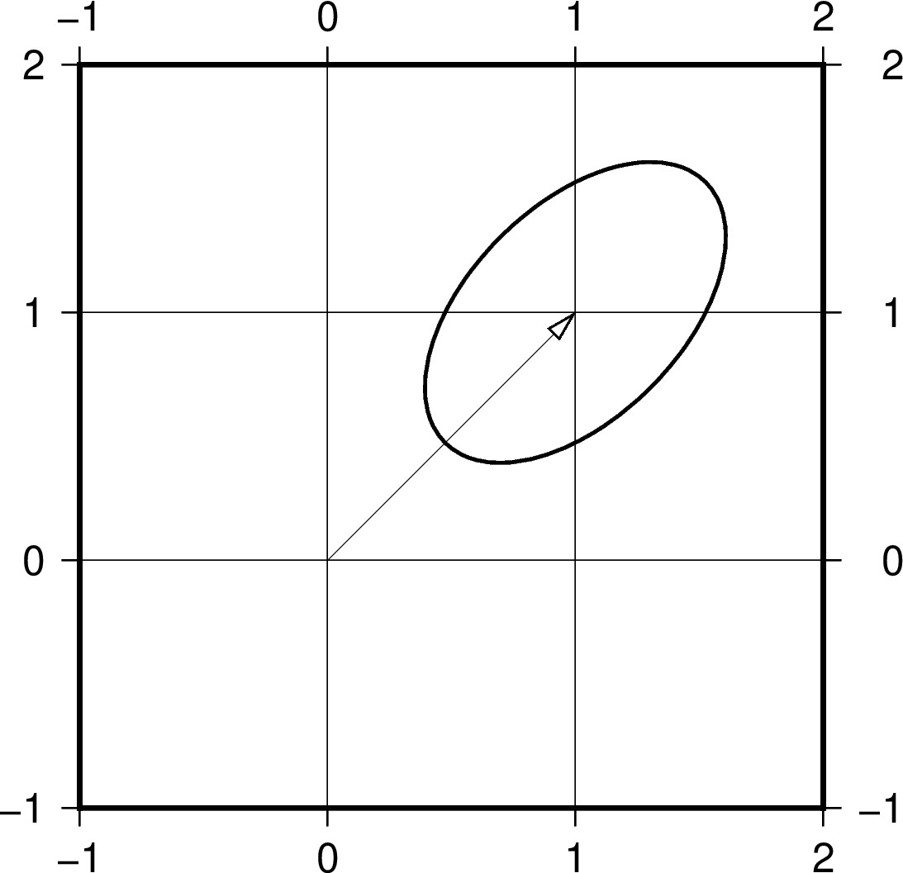
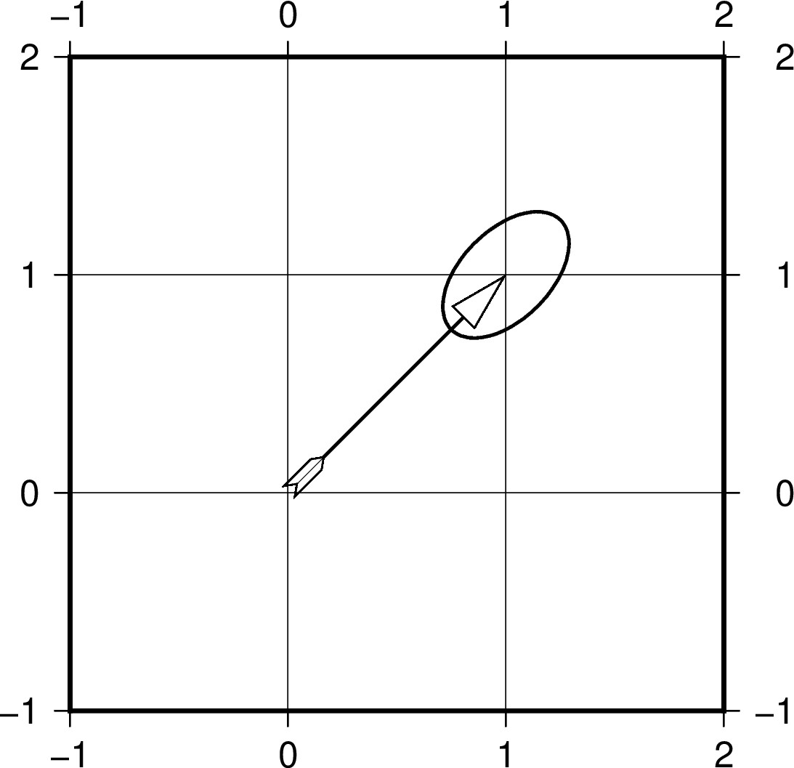
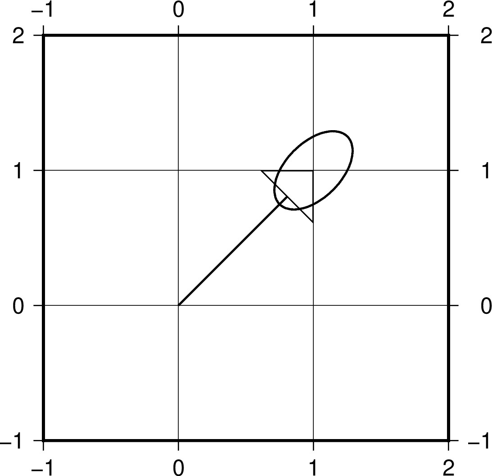
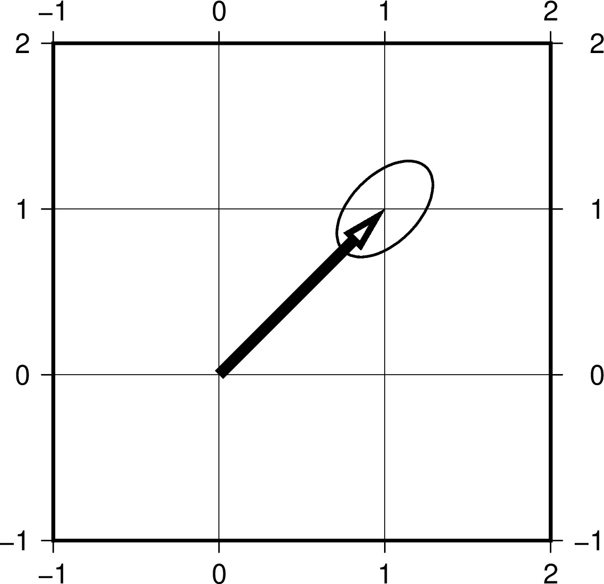
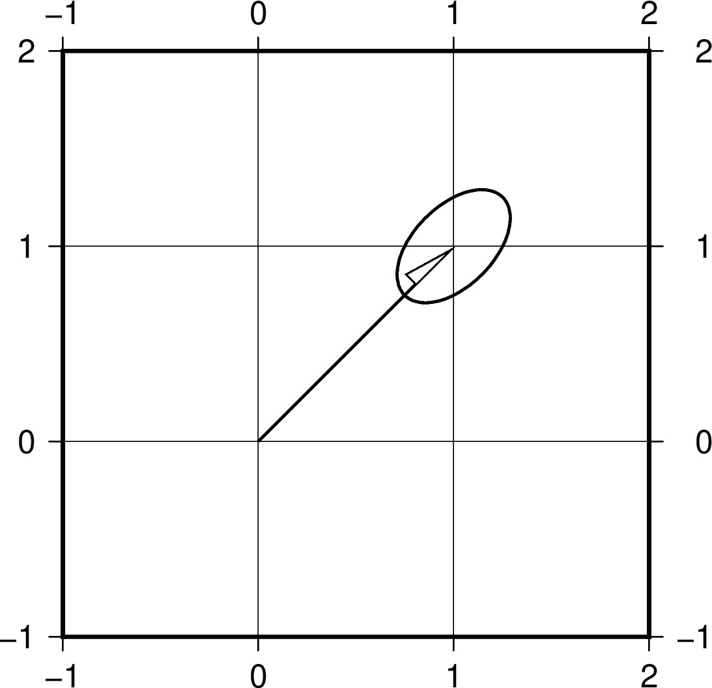
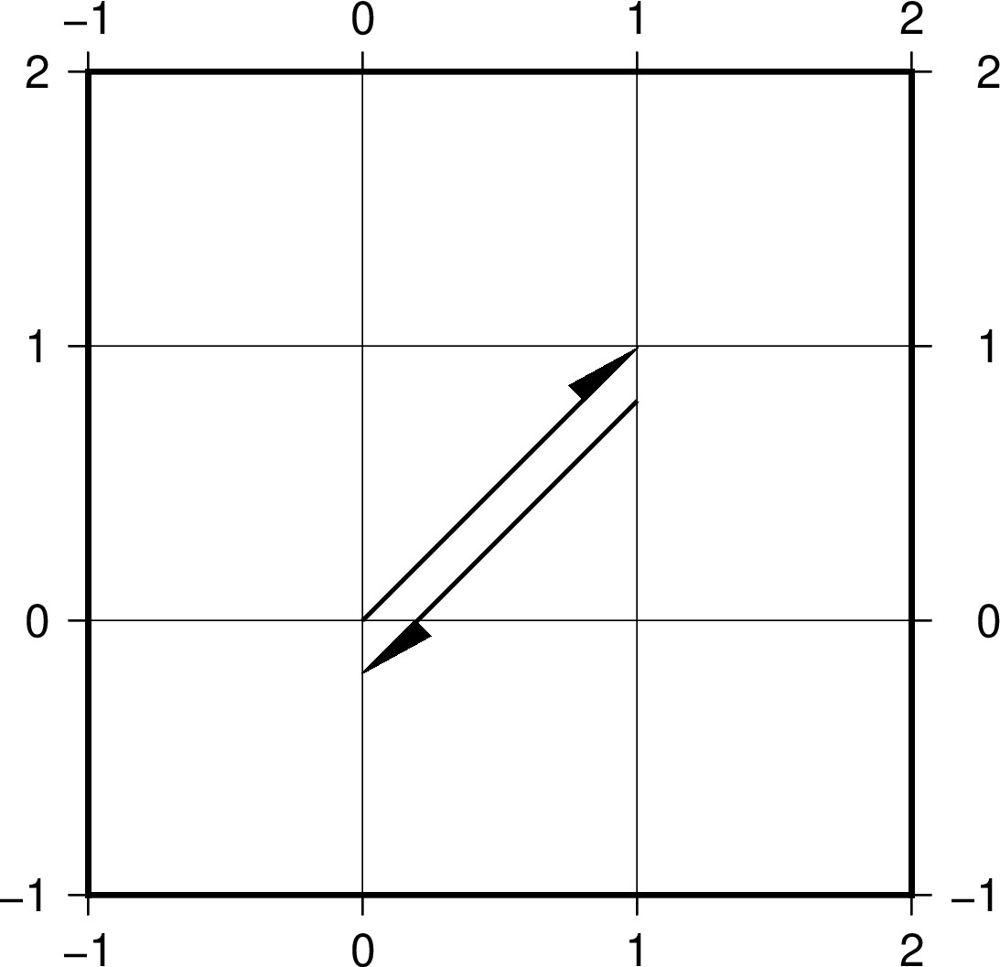

# Plotting deformation map with vectors

This part of the tutorial is to plot vector (GNSS) data. For grided data go to https://github.com/GenericMappingTools/2020-unavco-course/tree/master/grids

## Topics
* [Vector attributes and examples](#vector-attributes)
* [Plotting deformation field with vectors - Ridgecrest earthquakes](#Plotting-deformation-field-with-vectors---Ridgecrest-earthquakes)

## Vector attributes and examples
This part we will experiment with plotting velocity vectors mainly using the ***gmt velo -Se*** command.

### Vector attributes
The ***-Se*** option alows to plot arrows with uncertainty ellipses, the followed options are ***-Se*velscale/confidence/fontsize**

The input file requires input of ***longitude latitude E-vel N-vel E-sig N-sig CorrEN [Sitename]***

The arrow attributes are mainly controlled by the ***-A[size]*** option with additional attributes that can be specified by 

***+a*** angle (of the arrow head apex, default 30)

***+b/e/m[t/c/a/i]*** placing arrow at ***b***eginning/***e***nd/***m***iddle of the vector with symbols of ***t***erminal-line/***c***ircle/***a***rrow/ta***i***l

***+g*** filling arrow color

***+p*** width of the vector line (note the common ***-W*** for ***-Se*** is the width of the uncertainty ellipsev and the vector segment)

***+l/r*** plotting ***l***eft or ***r***ight half of the arrow

***+n[norm]*** ***n***ormalizing the vectors with decreasing length (norm/length)

### Examples
Below we will try these attributes with examples, first we'll create a script with the following command in your terminal
```
gmt --new-script > demo.sh
chmod +x demo.sh
```
Then open the script for editing in your script editor. Change the corresponding shell in the first line to your designated shell, and change the following lines to
```
echo "0 0 1 1 0.2 0.2 0" > tmp.dat
JRB="-JX3/3 -R-1/2/-1/2 -Ba1f1g1"
gmt begin vectors jpg
    gmt velo $JRB -Se1.0/0.65/10 -W1p
gmt end show
```
Inside we are plotting with 1.0 scale, and 0.65 confidence level corresponds to 1 sigma gaussian error. The resulting plot looks like 



If we change the ***-Se1.0/0.65/10*** to ***-Se1.0/0.99/10***, which correspond to 3 sigma, the circle will increase



If we then add a correlation of 0.5 between east and north error by replacing the ***echo*** line with ***echo "0 0 1 1 0.2 0.2 0.5" > tmp.dat***, the shape of the circle will be squeezed toward the correlated direction.



To learn about the attributes, we'll modify based on the following lines 
```
echo 0 0 1 1 0.2 0.2 0.5  > tmp.dat
JRB="-JX3/3 -R-1/2/-1/2 -Ba1f1g1"
gmt begin vectors jpg
    gmt velo tmp.dat $JRB -Se1.0/0.65/10 -W1p -A20p+ea
gmt end show
```
This will produce an ***A***rrow with an ***a***rrow at the ***e***nd of the vector that has the size of ***20p***


Then if we tweek the ***-A*** option to ***-A20p+ea+bi*** or ***-A20p+ea+gblue*** or ***-A20p+ea+a90*** or ***-A20p+ea+p5*** or ***-A20p+ea+l***

    

### Bonus challenge

How to plot a right-lateral strike slip sign like below?



## Plotting deformation field with vectors - Ridgecrest earthquakes
This part we will plot a vectorized deformation map + shaeded dem + GNSS data + fault traces + etc ...
