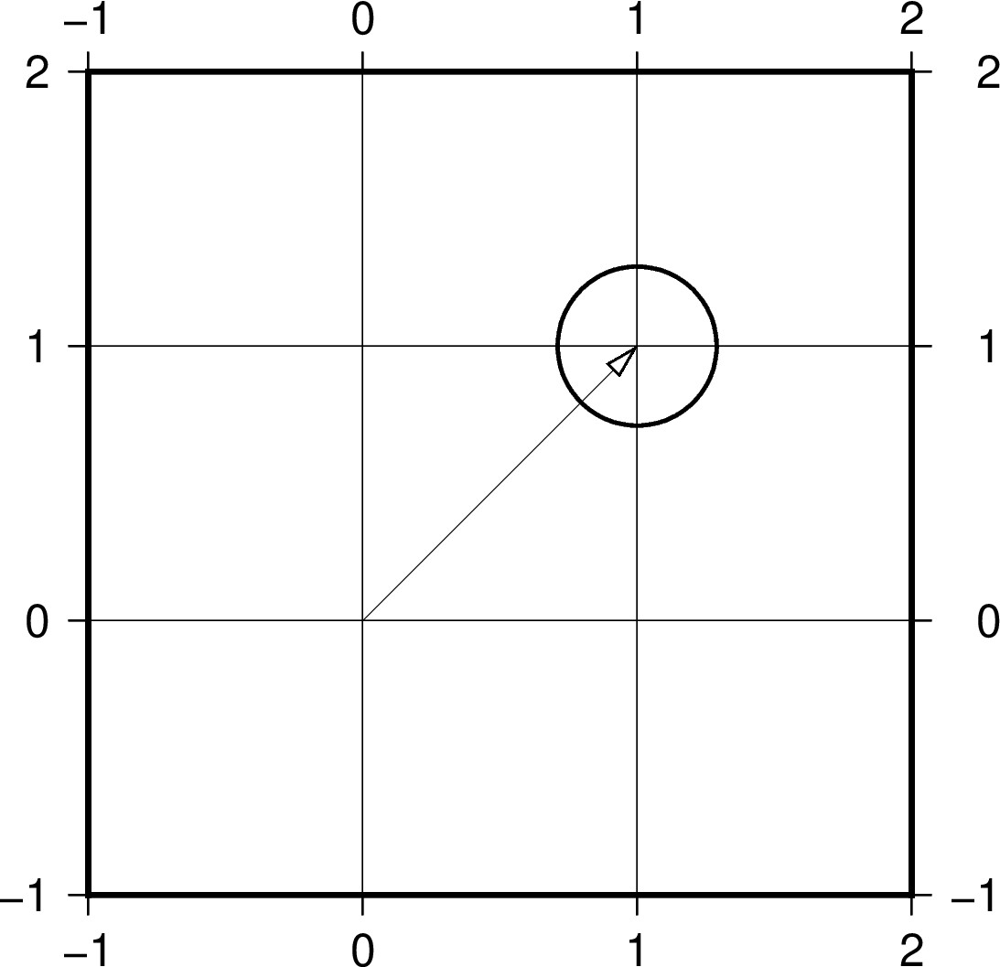

# Plotting deformation map with vectors

This part of the tutorial is to plot vector (GNSS) data. For grided data go to https://github.com/GenericMappingTools/2020-unavco-course/tree/master/grids

## Topics
* [Vector attributes and examples](#vector-attributes)
* [Plotting deformation field with vectors - Ridgecrest earthquakes](#Plotting-deformation-field-with-vectors---Ridgecrest-earthquakes)

## Vector attributes and examples
This part we will experiment with plotting velocity vectors mainly using the ***gmt velo -Se*** command.

### Vector attributes
The ***-Se*** option alows to plot arrows with uncertainty ellipses, the followed options are ***-Se*velscale/confidence/fontsize**

The input file requires input of ***longitude latitude E-vel N-vel E-sig N-sig CorrEN [Sitename]***

The arrow attributes are mainly controlled by the ***-A[size]*** option with additional attributes that can be specified by 

***+a*** rotation angle (of the arrow head)

***+b/e/m[t/c/a/i]*** placing arrow at ***b***eginning/***e***nd/***m***iddle of the vector with symbols of ***t***erminal-line/***c***ircle/***a***rrow/ta***i***l

***+g*** filling arrow color

***+p*** width of the vector line (note the common ***-W*** for ***-Se*** is the width of the uncertainty ellipse)

***+l/r*** plotting ***l***eft or ***r***ight half of the arrow

***+n[norm]*** ***n***ormalizing the vectors with decreasing length (norm/length)

### Examples
Below we will try these attributes with examples, first we'll create a script with the following command in your terminal
```
gmt --new-script > demo.sh
chmod +x demo.sh
```
Then open the script for editing in your script editor. Change the corresponding shell in the first line to your designated shell, and change the following lines to
```
echo "0 0 1 1 0 0 0" > tmp.dat
JRB="-JX3/3 -R-1/2/-1/2 -Ba1f1g1"
gmt begin vectors jpg
    gmt velo $JRB -Se1.0/0.65/10 -W1p
gmt end show
```
The resulting plot looks like 


## Plotting deformation field with vectors - Ridgecrest earthquakes
This part we will plot a vectorized deformation map + shaeded dem + GNSS data + fault traces + etc ...
